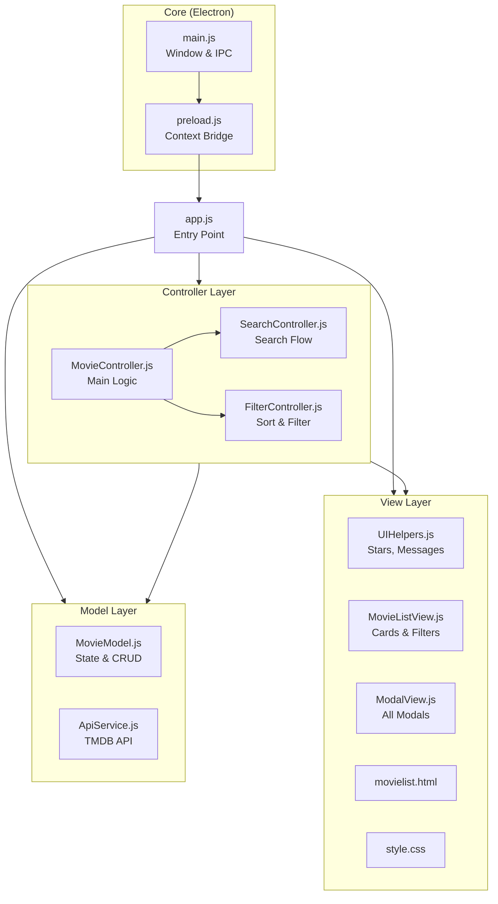
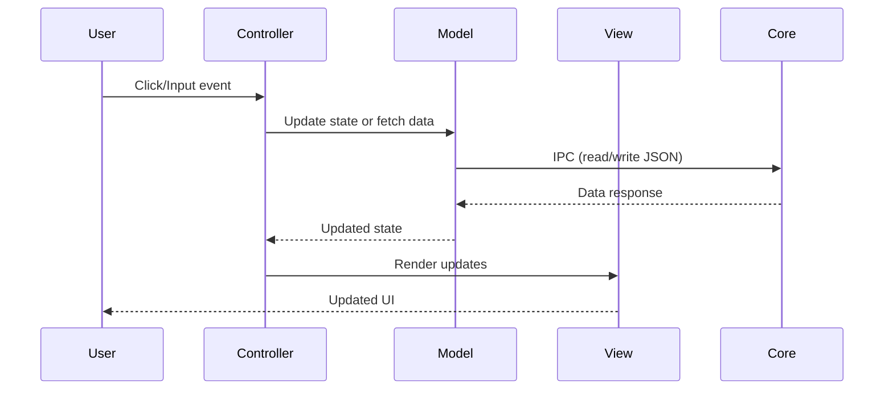

# Electron Movie Tracker

## Table of Contents
1. [Overview & Purpose](#overview--purpose)  
2. [Architecture](#architecture)
3. [Project Structure](#project-structure)
4. [Setup & Installation](#setup--installation)  
5. [Running the Application](#running-the-application)
6. [Building the Application](#building-the-application)
7. [Testing](#testing)
8. [Usage Examples](#usage-examples)  
9. [Key Modules & Functions](#key-modules--functions)  
10. [Data Flow & Dependencies](#data-flow--dependencies)  
11. [Error Handling & Edge Cases](#error-handling--edge-cases)  
12. [Customization & Extension](#customization--extension)  
13. [Known Limitations & Future Improvements](#known-limitations--future-improvements)

---

## Overview & Purpose  
This Electron-based application helps you build and maintain a personal "watched movies" list:

- Persist movie data locally in a JSON file  
- Search The Movie Database (TMDB) for titles  
- Record details (rating, watch date, format, rewatch status)  
- Filter & sort your collection by year, genre, director, format, rating, or date  
- View full details with external links to IMDb & Letterboxd  
- **Development & Production Modes** for safe testing

---

## Architecture

The application follows a **Model-View-Controller (MVC)** architecture for clean separation of concerns:



### How Modules Connect

| Layer | Responsibility | Dependencies |
|-------|---------------|--------------|
| **Core** | Electron main process, IPC, file I/O | Node.js, Electron |
| **Model** | Data state, CRUD operations, API calls | Core (via IPC) |
| **View** | DOM rendering, UI components | Model (for constants) |
| **Controller** | Event handling, business logic | Model, View |
| **Entry Point** | Bootstrap & wire all modules | All layers |

---

## Project Structure

```
Electron-movie/
├── .env                        # Environment variables (TMDB API key)
├── package.json                # Node.js project manifest
├── package-lock.json           # Dependency lock file
├── README.md                   # This file
│
├── data/                       # Data files
│   ├── movie-data.dev.json     # Development data
│   └── movie-data.json         # Production data (created on first run)
│
└── src/
    ├── app.js                  # Entry point - initializes all modules
    │
    ├── core/                   # Electron main process
    │   ├── main.js             # Window creation, IPC handlers
    │   └── preload.js          # Context bridge for secure IPC
    │
    ├── model/                  # Data layer
    │   ├── MovieModel.js       # State management, CRUD, filtering
    │   └── ApiService.js       # TMDB API integration
    │
    ├── view/                   # UI layer
    │   ├── templates/
    │   │   └── movielist.html  # Main HTML template
    │   ├── styles/
    │   │   └── style.css       # Dark theme stylesheet
    │   ├── UIHelpers.js        # Messages, stars, poster images
    │   ├── MovieListView.js    # Movie cards, filter dropdowns
    │   └── ModalView.js        # Details, info, delete, settings modals
    │
    └── controller/             # Logic layer
        ├── MovieController.js  # Main app coordination & form handling
        ├── ModalManager.js     # Stack-based modal management
        ├── SearchController.js # Search input, TMDB selection
        └── FilterController.js # Sort & filter event handling
```

---

## Setup & Installation  

1. **Prerequisites**  
   - Node.js (v14+) & npm  
   - A [TMDB API key](https://developers.themoviedb.org)  

2. **Clone & Install**  
   ```powershell
   git clone https://github.com/your-repo/Electron-movie-json-demo.git
   cd Electron-movie-json-demo
   npm install
   ```

3. **Configure TMDB Key**  
   - Create a file named `.env` in the project root  
   - Add your key:
     ```text
     APIKEY=your_token_here
     ```

---

## Running the Application

### Development Mode
- **Command**: `npm start`
- **Data File**: `data/movie-data.dev.json`
- **Behavior**: Save location is fixed to prevent accidental overwrites

```powershell
npm start
```

### Production Mode
- **Command**: `npm run start:prod`
- **Data File**: `data/movie-data.json` or custom location
- **Behavior**: Full save location control via Settings

```powershell
npm run start:prod
```

---

## Building the Application

Create distributable packages using `electron-builder`:

### Windows Installer
```powershell
npm run build
```
**Output**: `dist/Movie Tracker Setup x.x.x.exe` (NSIS installer)

### Unpacked Build (for testing)
```powershell
npm run pack
```
**Output**: `dist/win-unpacked/` folder with standalone executable

### Build Configuration
Build settings are in `package.json`:
```json
{
  "build": {
    "appId": "com.movie.tracker",
    "productName": "Movie Tracker",
    "win": {
      "target": "nsis",
      "icon": "build/icon.ico"
    },
    "directories": {
      "output": "dist"
    }
  }
}
```

> [!NOTE]
> For custom icons, place `icon.ico` (256x256 recommended) in a `build/` folder.

---

## Testing

The project uses **Jest** for unit testing with a test structure that mirrors the `src/` folder.

### Running Tests

```powershell
npm test              # Run all tests once
npm run test:watch    # Watch mode - auto-reruns on file changes (press q to quit)
npm run test:coverage # Generates coverage report in coverage/ folder

# Run a specific test file
npm test -- test/model/MovieModel.test.js

# Run all tests in a folder
npm test -- test/controller/

# Run tests matching a pattern
npm test -- --testPathPattern="Controller"
```

> **Watch mode** keeps Jest running and re-runs tests automatically when you save changes - great for development.  
> **Coverage** shows which lines of code are tested vs untested, with an HTML report you can view in a browser.

### Test Structure

```
test/
├── setup.js                    # Global mocks (electronAPI, fetch)
├── core/
│   ├── main.test.js           # Main process documentation tests
│   └── preload.test.js        # IPC API shape tests
├── model/
│   ├── MovieModel.test.js     # CRUD, filtering, sorting tests
│   └── ApiService.test.js     # API calls with mocked fetch
├── controller/
│   ├── ModalManager.test.js   # Stack push/pop tests
│   ├── MovieController.test.js
│   ├── SearchController.test.js
│   └── FilterController.test.js
└── view/
    ├── UIHelpers.test.js      # Stars, messages, debounce
    ├── MovieListView.test.js  # Card rendering, filters
    ├── ModalView.test.js      # Modal show/hide
    └── PosterGridView.test.js # Poster grid, infinite scroll
```

### Writing Tests

Tests use `jest.mock()` to mock dependencies. Example:

```javascript
jest.mock('../../src/model/ApiService.js', () => ({
    searchMoviesByTitle: jest.fn()
}));

test('search returns results', async () => {
    ApiService.searchMoviesByTitle.mockResolvedValue([{ title: 'Test' }]);
    // ... test code
});
```

---

## Usage Examples  

- **Add a Movie**  
  1. Click **Search** → Type a title → Click "Add"  
  2. Fill in rating, date, format → Click **Add to List**  

- **Edit/Delete**  
  1. Click a movie card → Click **Edit** or **Delete**  

- **Filter & Sort**  
  - Toggle filters panel, choose genre/director/year/format  
  - Use sort dropdown for date or rating  

- **External Links**  
  - In info modal, click **IMDb** or **Letterboxd**  

---

## Key Modules & Functions  

### Core Layer

#### `core/main.js`
| IPC Handler | Description |
|-------------|-------------|
| `read-json` | Reads & parses movie data JSON (with `.bak` backup auto-recovery) |
| `write-json` | Writes movie data atomically via `.tmp` staging and updates `.bak` |
| `get-api-key` | Returns TMDB key from `.env` |
| `is-dev` | Checks development mode |
| `select-save-location` | Opens file dialog for save path |

### Model Layer

#### `model/MovieModel.js`
- **State**: `watchedMovies`, `movieToAdd`, filter/sort settings
- **CRUD**: `addMovie()`, `updateMovie()`, `deleteMovie()`, `findMovieByEntryId()`
- **Data**: `loadState()`, `saveState()`, `getFilteredAndSortedMovies()`

#### `model/ApiService.js`
- `searchMoviesByTitle(query)` → TMDB search results
- `getMovieDetails(tmdbId)` → Full movie data with director & genres
- `listAllPosters(tmdbId)` → Available poster options

### View Layer

#### `view/UIHelpers.js`
- `showMessage()`, `showDetailsModalMessage()` → Toast notifications
- `renderStarsHtml()` → Star rating display with half-star support
- `createPosterImage()` → Image with fallback chain

#### `view/MovieListView.js`
- `renderMovies()` → Movie card grid
- `renderFilters()` → Filter dropdown population
- `renderSearchResults()` → Search result cards

#### `view/ModalView.js`
- `openDetailsModal()`, `closeDetailsModal()` → Add/Edit modal
- `openInfoModal()`, `closeInfoModal()` → View details modal
- Modal state checks: `isDetailsModalVisible()`, etc.

### Controller Layer

#### `controller/MovieController.js`
- `loadApp()` → Bootstrap application
- `setupEventListeners()` → Wire all event handlers
- `refreshView()`, `refreshFiltersAndView()` → Update UI

#### `controller/SearchController.js`
- Debounced search input handling
- Search result selection flow

#### `controller/FilterController.js`
- Sort/filter dropdown change handlers
- Filter reset functionality

#### `controller/ModalManager.js`
- Stack-based modal management with `push()`, `pop()`, `handleEscape()`
- Modal registration system: `register(name, {open, close, isVisible})`
- ESC key automatically closes topmost modal

---

## Data Flow & Dependencies  



**Dependencies**: `electron`, `electron-updater`, `electron-reloader` (dev), `dotenv`, `cross-env`

---

## Automated Updates & CI/CD

This application features an end-to-end automated update pipeline using **GitHub Actions** and **electron-updater**.

### CI/CD Pipeline (GitHub Actions)
1. **Trigger**: Whenever you push code directly to the `main` branch, the `.github/workflows/release.yml` workflow takes over.
2. **Auto-Tagging (No Code Commits!)**: The workflow finds your latest Git tag, increases the version (e.g. `v1.0.0` -> `v1.0.1`), updates the build files in memory, and pushes **only the new tag** back to GitHub. Your source code is never modified by the robot!
3. **Publishing**: It then builds the Windows executable and publishes it as a GitHub Release attached to that new tag.

### How the Auto-Updater Works Functionally
When a user launches the compiled application (Production mode), the auto-updater kicks in silently:
1. **Background Check**: `electron-updater` reads the application's internal version (from `package.json`) and queries the GitHub Releases API for this repository. If it finds a release tag that is higher than the current app version, an update is available.
2. **IPC Communication**: The Electron Main Process (`main.js`) catches events from `electron-updater` (like `checking-for-update`, `update-available`, `download-progress`) and securely broadcasts them to the UI Window via IPC channels defined in `preload.js`.
3. **Settings UI**: The user can open the **Settings** modal to interact with the updater:
   - **Current Version**: Displays the currently installed version.
   - **Check for Updates**: Users can manually trigger a check.
   - **Download Update**: If an update is available, a blue button appears allowing the user to begin the download in the background. Progress percentages are streamed to the UI in real-time.
   - **Restart & Install**: Once the download completes, a green button appears. Clicking it safely quits the application, executes the downloaded installer, and automatically relaunches the updated app.
> **Note on Development Mode**: The auto-updater is intentionally disabled when running via `npm start`. If you click "Check for Updates" in dev mode, the app will explicitly warn you that auto-updating is disabled to prevent configuration errors.

---

## Error Handling & Edge Cases  

- **Missing TMDB Key**: Disables search & shows error banner  
- **Empty Search Results**: Displays "No results found"  
- **Atomic File Writing & Data Safety**: Writes data to a temporary file (`.tmp`) before performing an atomic rename, preventing file corruption on crashes  
- **Automatic Backup & Recovery**: Maintains a persistent `.bak` backup copy of your previous save state. Before backing up, the app validates `movie-data.json` to prevent overwriting `.bak` if the disk file was corrupted externally. Automatically restores from `.bak` if the primary JSON file fails to parse or is missing  
- **Auto-Updater in Development**: Update checks are disabled in development mode to prevent configuration errors.
- **Form Validation**: Requires rating > 0 & watch date  

---

## Customization & Extension  

- **Theme**: Update CSS variables in `:root`  
- **New Filters**: Add options to `FilterController.js` and `MovieListView.js`  
- **New Data Fields**: Extend `MovieModel.js` and modal views  
- **Database**: Replace JSON IPC in `MovieModel.js` with SQLite/IndexedDB  

---

## Known Limitations & Future Improvements  

- **Performance**: Consider virtualization for large collections  
- **Caching**: No offline TMDB result cache  
- **Validation**: Minimal duplication checks  
- **Accessibility**: Improve ARIA roles & keyboard focus  
- **Testing**: Add Jest/Mocha tests for modules  

Enjoy maintaining your personal movie library with this Electron tracker!
