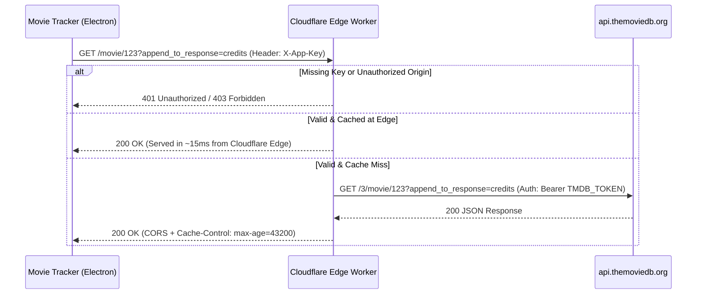

# TMDB Cloudflare Edge Proxy

A secure, high-performance reverse proxy for The Movie Database (TMDB) API, built on Cloudflare Workers. 

It provides seamless, zero-configuration movie searches and Letterboxd synchronization for the Movie Tracker desktop app, completely eliminating the need for local `.env` files or personal TMDB developer accounts for friends, family, and contributors.

---

## Architecture & Data Flow



---

## Core Features & Safeguards

| Feature | How It Works | Benefit |
| :--- | :--- | :--- |
| **Zero Client Setup** | TMDB secret key is stored in Cloudflare's encrypted memory | Friends/contributors can clone and run the app with 0 configuration |
| **`X-App-Key` Handshake** | Verified with constant-time equality (`timingSafeEqual`) | Blocks automated web crawlers and random scrapers (`401 Unauthorized`) |
| **Origin Whitelisting** | Parsed with `new URL(origin).hostname` | Blocks external websites from leeching proxy bandwidth; permits local Electron & localhost |
| **50% Request Reduction** | Combines details and credits via `append_to_response=credits` | 50 movies sync in 50 requests instead of 100, cutting sync time in half |
| **Deterministic Caching** | Sorts parameters (`cleanParams.sort()`) and sub-values | Guarantees identical searches hit the exact same cache slot |
| **Empty Search Short-Circuit** | Evaluates empty queries at the edge in 1ms | Saves upstream TMDB API quota from accidental or blank searches |
| **Burst Limiter** | Sliding-window limiter (40 req / 10s per IP) capped at 2,000 IPs | Prevents accidental client loops from flooding TMDB |
| **Multi-Tier Caching** | Edge: 24h for details; Client: 12h `Cache-Control` | Repeated movie views load in 0ms from local memory cache |

---

## Deployment Options

You can manage and deploy the worker using either the **Wrangler CLI** or the **Cloudflare Web Dashboard**.

### Option A: Wrangler CLI (Fastest for Developers)

1. **Log in to Cloudflare:**
   ```powershell
   cd cloudflare-worker
   npx wrangler login
   ```
   *(A browser window will open to authorize Wrangler).*

2. **Set your TMDB Secret Token:**
   ```powershell
   npx wrangler secret put TMDB_TOKEN
   ```
   *(Paste your TMDB v4 Read Access Token when prompted).*

3. **Deploy:**
   ```powershell
   npx wrangler deploy
   ```
   *(Your worker is bundled and published live in ~3 seconds).*

---

### Option B: Cloudflare Web Dashboard (No CLI Needed)

1. Log into your [Cloudflare Dashboard](https://dash.cloudflare.com/) > **Workers & Pages** > **Overview**.
2. Click **Create Application** > **Create Worker** > name it `tmdb-proxy` and click **Deploy**.
3. Under **Settings** > **Variables and Secrets** > **Secrets**:
   * Add `TMDB_TOKEN` = your TMDB v4 Read Access Token (starts with `eyJ...`) or v3 API Key.
   * *(Optional)* Add `CLIENT_KEY` = `MovieTracker-Client-Secure-2026`.
4. Click **Quick Edit** (or **Edit Code**), paste the contents of [`src/worker.js`](src/worker.js), and click **Deploy**.

---

## Verification & Testing

You can test your deployed worker using `curl` from PowerShell, Command Prompt, or terminal:

### 1. Unauthorized Access Test (Expected: 401)
```powershell
curl.exe -i "https://tmdb-proxy.movie-feed.workers.dev/3/search/movie?query=Inception"
```
**Expected Response:**
```json
{"error": "Unauthorized: Access restricted to Movie Tracker app"}
```

### 2. Authorized Search Test (Expected: 200)
```powershell
curl.exe -i -H "X-App-Key: MovieTracker-Client-Secure-2026" "https://tmdb-proxy.movie-feed.workers.dev/3/search/movie?query=Inception"
```
**Expected Response:** `HTTP/1.1 200 OK` with TMDB movie search results and `Cache-Control` headers.

### 3. Combined Details + Credits Test (Expected: 200)
```powershell
curl.exe -i -H "X-App-Key: MovieTracker-Client-Secure-2026" "https://tmdb-proxy.movie-feed.workers.dev/3/movie/27205?append_to_response=credits"
```
**Expected Response:** `HTTP/1.1 200 OK` returning movie details and director credits in a single payload.

### 4. External Website Blocker Test (Expected: 403)
```powershell
curl.exe -i -H "X-App-Key: MovieTracker-Client-Secure-2026" -H "Origin: https://unauthorized-website.com" "https://tmdb-proxy.movie-feed.workers.dev/3/search/movie?query=Inception"
```
**Expected Response:** `HTTP/1.1 403 Forbidden` (`{"error": "Forbidden: External websites are not permitted to use this proxy"}`).

---

## Supported Endpoints

The proxy enforces a strict whitelist allowing only safe read endpoints:
- `GET /3/search/movie?query=...`
- `GET /3/movie/{id}` (supporting `?append_to_response=credits,images,videos`)
- `GET /3/movie/{id}/(credits|images|videos)`
- `GET /3/trending/movie/(day|week)`
- `GET /3/movie/(popular|top_rated|now_playing|upcoming)`
- `GET /3/genre/movie/list`

---

## Automated Unit Tests

A comprehensive unit test suite is included in `test/worker.test.js`, testing CORS, origin security, authentication handshakes, rate limiting, and canonical caching:

```powershell
cd cloudflare-worker
npm test
```
*(Runs natively via Node.js built-in test runner without external dependencies).*

