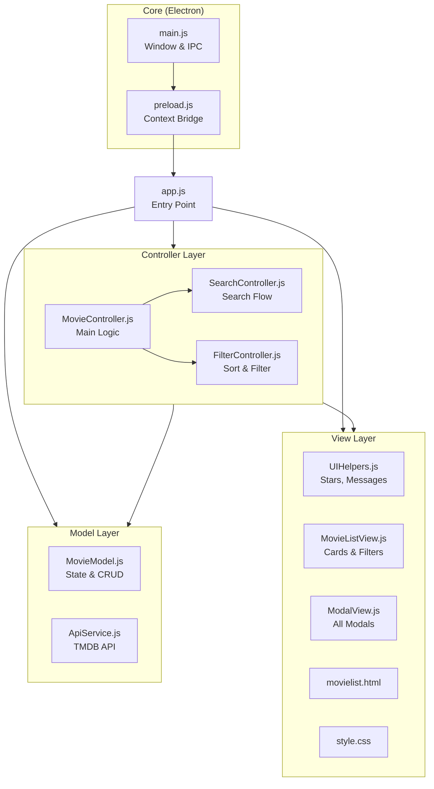
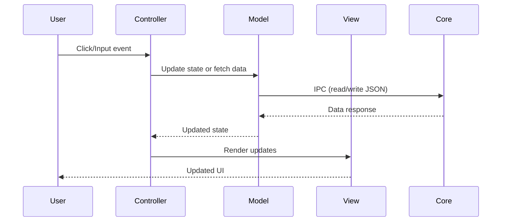

# Architecture & Data Flow

This document details the architecture of the Electron Movie Tracker.

## Architecture

The application follows a **Model-View-Controller (MVC)** architecture for clean separation of concerns:



### How Modules Connect

| Layer | Responsibility | Dependencies |
|-------|---------------|--------------|
| **Core** | Electron main process, IPC, file I/O | Node.js, Electron |
| **Model** | Data state, CRUD operations, API calls | Core (via IPC) |
| **View** | DOM rendering, UI components | Model (for constants) |
| **Controller** | Event handling, business logic | Model, View |
| **Entry Point** | Bootstrap & wire all modules | All layers |

## Project Structure

```text
Electron-movie/
├── .env                        # Environment variables (TMDB API key)
├── package.json                # Node.js project manifest
├── package-lock.json           # Dependency lock file
├── README.md                   # This file
│
├── data/                       # Data files
│   ├── movies.dev.db           # Development SQLite database (WAL mode)
│   ├── movie-data.dev.json     # Legacy dev data (auto-migrated)
│   └── movie-data.dev.json.migrated.bak # Safety backup archive
│
└── src/
    ├── app.js                  # Entry point - initializes all modules
    │
    ├── core/                   # Electron main process
    │   ├── main.js             # Window creation, IPC handlers
    │   ├── DatabaseService.js  # SQLite database, WAL mode, CRUD, debounced backup
    │   ├── preload.js          # Context bridge for secure IPC
    │   └── LetterboxdService.js# Letterboxd RSS parsing logic
    │
    ├── model/                  # Data layer
    │   ├── MovieModel.js       # State management, CRUD, filtering
    │   └── ApiService.js       # TMDB API integration
    │
    ├── view/                   # UI layer
    │   ├── templates/
    │   │   └── movielist.html  # Main HTML template
    │   ├── styles/
    │   │   └── style.css       # Dark theme stylesheet
    │   ├── UIHelpers.js        # Messages, stars, poster images
    │   ├── MovieListView.js    # Movie cards, filter dropdowns
    │   └── ModalView.js        # Details, info, delete, settings modals
    │
    └── controller/             # Logic layer
        ├── MovieController.js  # Main app coordination & form handling
        ├── ModalManager.js     # Stack-based modal management
        ├── SearchController.js # Search input, TMDB selection
        └── FilterController.js # Sort & filter event handling
```

## Key Modules & Functions  

### Core Layer

#### `core/DatabaseService.js`
- **SQLite Engine**: `better-sqlite3` with WAL mode (`journal_mode = WAL`) and foreign keys.
- **Table**: `media_items` with primary key `entryId`, future-proof `media_type` ('movie', 'tv'), Letterboxd sync fields, and indexed watch dates and titles.
- **Migration**: Automatic zero-loss migration from legacy JSON on first launch.
- **Automatic Backup Engine**: 30-second debounced inactivity cooldown via `db.backup()` to any user-selected folder (local, external, or cloud-synced).
  - Automatically turns off if the destination folder is deleted or unmounted.
  - Interactive prompt to keep or delete `movies-backup.db` when disabling or disconnecting.
  - Immediate sync on folder selection and blocking flush on application exit.
- **Export Snapshot**: One-time isolated export to any file path (`db.backup()`) without attaching ongoing background timers.
- **Unified Restore**: Restores active SQLite database seamlessly from any `.db` file (automatic backup or exported snapshot).

#### `core/main.js`
| IPC Handler | Description |
|-------------|-------------|
| `db:get-all` | Fetches all media items from SQLite (supports optional `media_type` filtering) |
| `db:add-movie` | Inserts or updates media item in SQLite and schedules debounced backup |
| `db:update-movie` | Updates existing media item by entryId |
| `db:delete-movie` | Deletes media item from SQLite |
| `select-backup-location` | Directory picker for automatic backup folder with immediate initial backup |
| `get-backup-settings` | Retrieves backup folder, autoBackupEnabled, and last backup timestamp |
| `toggle-auto-backup` | Enables or disables automatic backup (with optional existing file deletion) |
| `remove-backup-folder` | Disconnects the backup folder (with optional existing file deletion) |
| `export-database` | Opens save dialog and exports a standalone `.db` snapshot |
| `trigger-backup-now` | Triggers immediate SQLite online backup |
| `restore-from-backup` | Restores database from a selected SQLite backup or snapshot file |
| `read-json` / `write-json` | Backward-compatibility proxies to DatabaseService |
| `get-api-key` | Retrieves TMDB key from `apiKey.txt` (Settings) or `.env` |
| `set-api-key` | Saves the TMDB key securely to the user data directory |
| `is-dev` | Checks development mode |

### Model Layer

#### `model/MovieModel.js`
- **State**: `watchedMovies`, `movieToAdd`, filter/sort settings
- **CRUD**: `addMovie()`, `updateMovie()`, `deleteMovie()`, `findMovieByEntryId()`
- **Data**: `loadState()`, `saveState()`, `getFilteredAndSortedMovies()`

#### `model/ApiService.js`
- `searchMoviesByTitle(query)` → TMDB search results
- `getMovieDetails(tmdbId)` → Full movie data with director & genres
- `listAllPosters(tmdbId)` → Available poster options

### View Layer

#### `view/UIHelpers.js`
- `showMessage()`, `showDetailsModalMessage()` → Toast notifications
- `renderStarsHtml()` → Star rating display with half-star support
- `createPosterImage()` → Image with fallback chain

#### `view/MovieListView.js`
- `renderMovies()` → Movie card grid
- `renderFilters()` → Filter dropdown population
- `renderSearchResults()` → Search result cards

#### `view/ModalView.js`
- `openDetailsModal()`, `closeDetailsModal()` → Add/Edit modal
- `openInfoModal()`, `closeInfoModal()` → View details modal
- Modal state checks: `isDetailsModalVisible()`, etc.

### Controller Layer

#### `controller/MovieController.js`
- `loadApp()` → Bootstrap application
- `setupEventListeners()` → Wire all event handlers
- `refreshView()`, `refreshFiltersAndView()` → Update UI

#### `controller/SearchController.js`
- Debounced search input handling
- Search result selection flow

#### `controller/FilterController.js`
- Sort/filter dropdown change handlers
- Filter reset functionality

#### `controller/ModalManager.js`
- Stack-based modal management with `push()`, `pop()`, `handleEscape()`
- Modal registration system: `register(name, {open, close, isVisible})`
- ESC key automatically closes topmost modal

## Data Flow & Dependencies  



**Dependencies**: `electron`, `electron-updater`, `electron-reloader` (dev), `dotenv`, `cross-env`, `fast-xml-parser`
