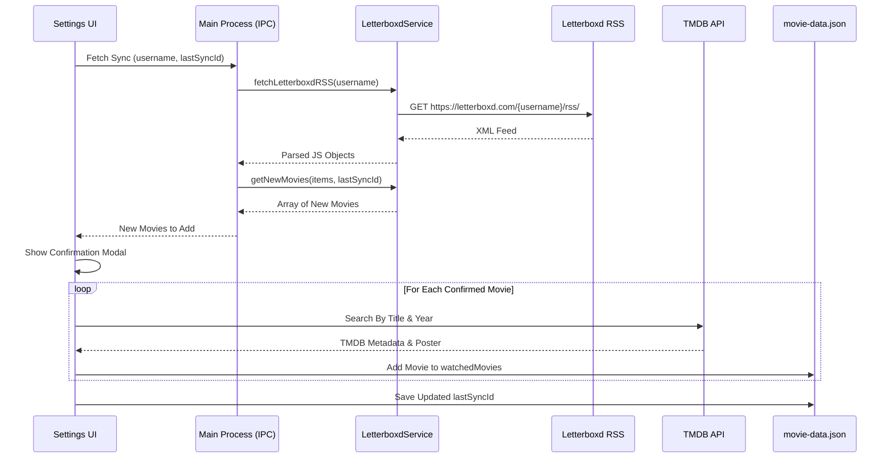

# Letterboxd Sync Integration

This document outlines how the Letterboxd Sync feature works, specifically focusing on the backend perspective and data flow.

## Overview

The Letterboxd Sync feature provides a 1-way synchronization from a user's Letterboxd diary to the local Movie Tracker application. It acts as a mirror, automatically fetching the user's latest watched movies and saving them to the local `movie-data.json` database. 

Currently, only the movie metadata (Title, Year, Release Date, Poster) is synced, with scores and reviews deferred for future updates.

## Architecture & Data Flow

The integration relies on reading the user's public Letterboxd RSS feed, parsing it, and determining which movies are "new" to the local application.

## Backend Perspective

### 1. The RSS Feed (`LetterboxdService.js`)
The application fetches the RSS feed directly from `https://letterboxd.com/{username}/rss/`.
We use `fast-xml-parser` to parse the XML feed into JSON.

### 2. Local Database Cross-Referencing
To determine which movies in the RSS feed are actually new, the application directly checks your local `movie-data.json` database.

- **Unique Identifiers:** Every item in the Letterboxd RSS feed contains a `<guid>` tag which serves as a mathematically unique Global Unique Identifier for that specific watch/diary entry (e.g., `letterboxd-watch-12345678`).
- **Sync Tracking:** When you sync a movie, its unique GUID is saved locally alongside the movie data as `letterboxdSyncId`.
- **Finding New Movies:** When a new sync is initiated, the application fetches all items from the RSS feed. Note that **Letterboxd limits its RSS feeds to only the last 50 reviewed items**. It then filters this list against your local database, perfectly identifying only those GUIDs that haven't been saved yet.
- **Rewatches:** Because we rely on the unique GUID of the watch event rather than the movie title, the application can accurately track rewatches. If you log the same movie 10 times on Letterboxd, each entry gets a unique GUID, and all 10 will sync perfectly.

### 3. TMDB Metadata Matching
Once the backend service identifies the new movies, the frontend takes over to enrich the data. It searches the TMDB API using the movie title and year parsed from the RSS feed. It grabs the official posters, genres, and metadata to ensure your local list maintains a high-quality visual standard.

### 4. Storage & Persistence
- The `letterboxdSettings.json` file (stored in the Electron `userData` directory) securely saves the username and the `lastSyncId`.
- Synced movies are persisted immediately to the user's selected `movie-data.json` file, using the application's robust atomic file-writing helpers.
