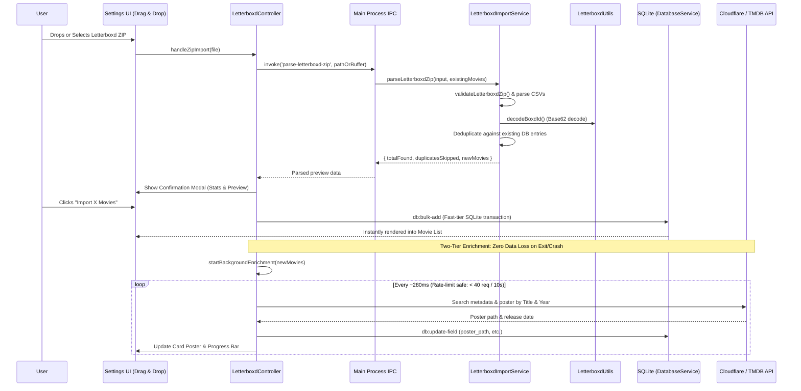

# Letterboxd Sync & Bulk Import Integration

This document outlines how the Letterboxd synchronization features work, covering both real-time **RSS 1-way sync** and historical **Bulk ZIP Import**.

---

## 1. Overview & Comparison

Letterboxd offers two ways to access user diary history:

| Capability | RSS Sync | Bulk ZIP Export Import |
|---|---|---|
| **Source** | `https://letterboxd.com/{username}/rss/` | `https://letterboxd.com/user/exportdata/` (ZIP) |
| **History Scope** | Capped at **50 most recent items** | **Entire user diary & review history** |
| **Reviews** | Snippets only | Complete multiline reviews from `reviews.csv` |
| **Watched Date** | `letterboxd:watchedDate` | Strict `Watched Date` column from `diary.csv` |
| **Tags / Format** | N/A | Maps `cinema` to `Cinema`, etc. |
| **Best Used For** | Ongoing daily/weekly incremental sync | Initial setup or historical backfill |

---

## 2. Architecture & Data Flow

### Bulk ZIP Import Architecture

```mermaid
sequenceDiagram
    participant User as User
    participant UI as Settings UI (Drag & Drop)
    participant Ctrl as LetterboxdController
    participant IPC as Main Process IPC
    participant Svc as LetterboxdImportService
    participant Utils as LetterboxdUtils
    participant DB as SQLite (DatabaseService)
    participant TMDB as Cloudflare / TMDB API

    User->>UI: Drops or Selects Letterboxd ZIP
    UI->>Ctrl: handleZipImport(file)
    Ctrl->>IPC: invoke('parse-letterboxd-zip', pathOrBuffer)
    IPC->>Svc: parseLetterboxdZip(input, existingMovies)
    Svc->>Svc: validateLetterboxdZip() & parse CSVs
    Svc->>Utils: decodeBoxdId() (Base62 decode)
    Svc->>Svc: Deduplicate against existing DB entries
    Svc-->>IPC: { totalFound, duplicatesSkipped, newMovies }
    IPC-->>Ctrl: Parsed preview data
    Ctrl->>UI: Show Confirmation Modal (Stats & Preview)
    
    User->>UI: Clicks "Import X Movies"
    Ctrl->>DB: db:bulk-add (Fast-tier SQLite transaction)
    DB-->>UI: Instantly rendered into Movie List
    
    Note over Ctrl, TMDB: Two-Tier Enrichment: Zero Data Loss on Exit/Crash
    Ctrl->>Ctrl: startBackgroundEnrichment(newMovies)
    loop Every ~280ms (Rate-limit safe: < 40 req / 10s)
        Ctrl->>TMDB: Search metadata & poster by Title & Year
        TMDB-->>Ctrl: Poster path & release date
        Ctrl->>DB: db:update-field (poster_path, etc.)
        Ctrl->>UI: Update Card Poster & Progress Bar
    end
```

---

## 3. Bulk ZIP Import Implementation Details

### Strict Archive Validation
Before any parsing or database writes occur, `validateLetterboxdZip` ensures:
1. **ZIP Integrity & Magic Bytes**: Verifies `0x50, 0x4b` PK header bytes.
2. **`diary.csv` Presence**: The archive must contain `diary.csv` (case-insensitive, root or subfolder).
3. **Required CSV Columns**:
   - `diary.csv`: Must have `Name`, `Year`, `Letterboxd URI`, and `Watched Date`.
   - `reviews.csv` (if present): Must have `Letterboxd URI` and `Review`.
4. **Clean Abort**: If invalid, import cancels immediately with a user-friendly error dialog—zero partial database writes.

### Processing Order & Date Rule
- **Order**: Loops through `diary.csv` first to establish every watch event, then loops through `reviews.csv` matching by `Letterboxd URI` to attach multiline user reviews to the movie `comment` field.
- **Strict Watched Date**: Strictly uses the `Watched Date` column (the actual day the movie was watched), deliberately ignoring `Date` (which is only the day the entry was logged).

### Base62 Shortlink Mathematics & Unified Deduplication
To prevent duplicate entries between RSS sync and Bulk ZIP imports without slow network calls:
- In `diary.csv`, Letterboxd provides shortlinks like `https://boxd.it/fn7BQp` or `https://boxd.it/c3eVFV`.
- In RSS feeds, Letterboxd provides `<guid>letterboxd-watch-1408366198</guid>`.
- The shortlink slug is a Base62-encoded integer representing `numericId * 10 + checkDigit`.
- `decodeBoxdId()` mathematically reverses the Base62 slug:
  $$\text{Numeric ID} = \lfloor \text{Base62Decode}(\text{slug}) / 10 \rfloor$$
- **Unified Identifier**: Both RSS sync and Bulk ZIP import store `letterboxdSyncId = 'letterboxd-review-' + numericId`.
- **Deduplication Checks**:
  1. Primary: Exact match on decoded numeric ID (`letterboxdSyncId` / `letterboxdUrl`).
  2. Fallback for manual entries: Normalised `Title + Release Year + Watched Date`.
  3. Rewatches on different dates with distinct entries are preserved and never falsely skipped.

### Two-Tier Insertion & Rate-Limit Pacing
1. **Tier 1 (Instant DB Insertion)**: All movies are immediately saved into SQLite via `db:bulk-add`. If the app is closed, crashes, or loses power, all diary entries and reviews remain safely stored.
2. **Tier 2 (Background Enrichment)**:
   - Fetches TMDB posters and metadata in the background.
   - Paced with `sleep(280)` (~3.5 requests/sec), strictly staying well within the Cloudflare Worker rate limit of **40 requests / 10 seconds per IP**.
   - Includes an in-app visual progress bar indicating background progress.

---

## 4. RSS Feed Sync Implementation Details

### 1. The RSS Feed (`LetterboxdService.js`)
The application fetches the RSS feed directly from `https://letterboxd.com/{username}/rss/` using `fast-xml-parser`.

### 2. Cross-Referencing & RSS Limit
- Letterboxd RSS is capped by Letterboxd to the **last 50 items**.
- When syncing, the application cross-references every RSS item's `<guid>` with the local SQLite database.
- It also cross-checks decoded Base62 IDs, preventing duplicates if the movies were previously imported via Bulk ZIP.

---

## 5. Persistence & Backups

- **Settings**: Stored in `letterboxdSettings.json` in the user's `userData` directory.
- **Database**: All items persist in the primary SQLite database (`movies.db` / `movies.dev.db`).
- **Cloud Backup**: Automatically triggers the 30-second debounced `db.backup()` flush to OneDrive or user-configured backup destination.
